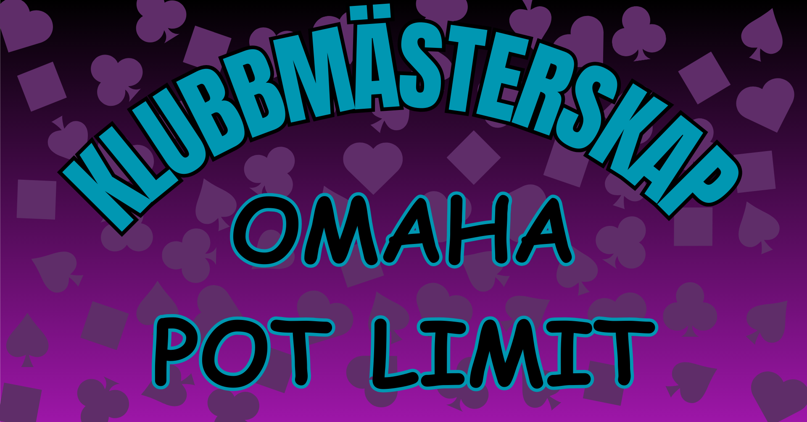

# PLO Klubbmästerskap 2024
### 2024-04-13

**KLUBBMÄSTERSKAP ENDAST FÖR MEDLEMMAR.**  

Turnering: Pot Limit Omaha  
Speltyp: Freezeout  
Inköp: 300  
Startstack: 40k  
Blindsnivå: 20 min  
Rake tas ur potten!  
Blindsen börjar på 25-50  
Starttid 15.00  
Late reg: Efter paus 2 (ca 17:20)  
Inga blinds dras av under latereg.  
Lokalen är i Fruhem.  
Ingång på långsidan mot vägen, upp för trappen och till vänster.  
Var vänlig och ANMÄL er på Facebook eventet, som en kommentar på Facebooksidan eller via epost vastanforspoker@gmail.com